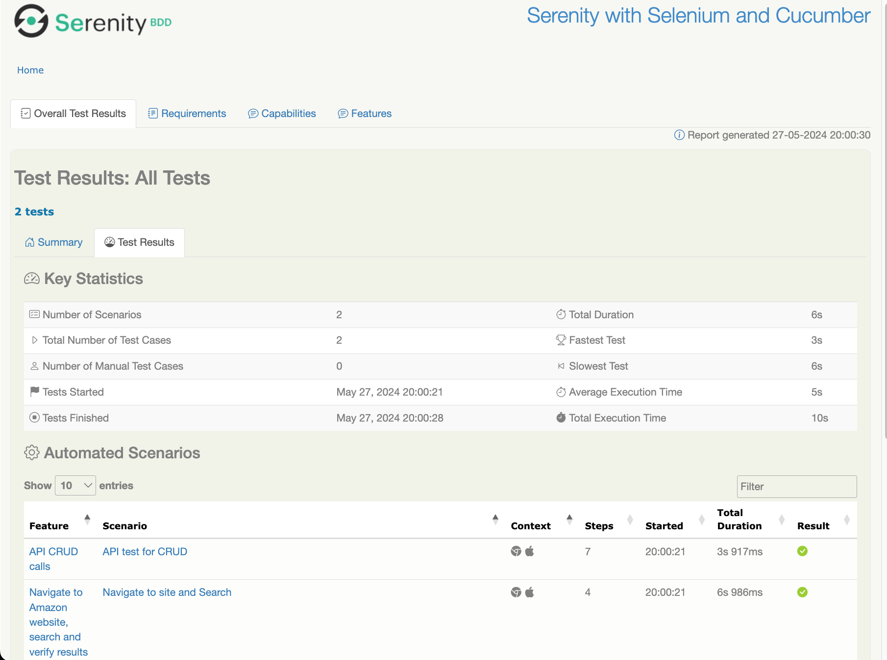

= Selenium with Cucumber and REST

This project shows one way to address UI Web based call and RESTful api via an openSource API restAssured
=== The project directory structure

The project has build scripts for Maven and follows the standard directory structure used in most Serenity projects:

[source,Feature file]
----
src
  + main
  + test
    + java                        Test runners and supporting code
    + resources
      + features                  Feature files
          + ui                      subdirectory
            ui-search-verify.feature
          + api                     subdirectory
            api-crud.feature
----
[source,Gherkin - UI]
----
Feature: Navigate to Amazon website, search and verify results

Scenario: Navigate to site and Search
    Given user navigates to "https://www.amazon.com/"
    When enter search term "iphone" on site
    Then verify that the 1st result contains "Apple iPhone"
    Then close the browser
----

[source,text - UI]
----
    @Given("user navigates to {string}")
    public void goToSite(String site) {
        searchPage.openPage(site);
    }

    @When("enter search term {string} on site")
    public void searchFor(String term) {
        searchPage.searchFor(term);
    }

    @Then("verify that the 1st result contains {string}")
    public void verifyResult(String resultText){
        assertTrue(resultText+" - NOT FOUND in 1st result of the search", searchPage.verifyResults(resultText));
    }

    @Then("close the browser")
    public void closeBrowser(){
        //close all active sessions
        searchPage.getDevTools().close();
        //quit and close all browser windows
        searchPage.getDriver().quit();
    }
----
== Executing the tests

To run the sample project, you can either just run the `CucumberTestSuite` test runner class, or run either `mvn verify` from the command line.

By default, the tests will run using Chrome. You can run them in Firefox by overriding the `driver` system property, e.g.

[source,json]
---
$ mvn clean verify -Ddriver=chrome
---

The test results will be recorded in the `target/site/serenity` directory,
open index.html

== Generating the reports

Since the Serenity reports contain aggregate information about all of the tests, they are not generated after each individual test (as this would be extremenly inefficient). Rather, The Full Serenity reports are generated by the `serenity-maven-plugin`. You can trigger this by running `mvn serenity:aggregate` from the command line or from your IDE.

They reports are also integrated into the Maven build process: the following code in the `pom.xml` file causes the reports to be generated automatically once all the tests have completed when you run `mvn verify`?

----
             <plugin>
                <groupId>net.serenity-bdd.maven.plugins</groupId>
                <artifactId>serenity-maven-plugin</artifactId>
                <version>${serenity.maven.version}</version>
                <configuration>
                    <tags>${tags}</tags>
                </configuration>
                <executions>
                    <execution>
                        <id>serenity-reports</id>
                        <phase>post-integration-test</phase>
                        <goals>
                            <goal>aggregate</goal>
                        </goals>
                    </execution>
                </executions>
            </plugin>
----

== Simplified WebDriver configuration and other Serenity extras

The sample projects both use some Serenity features which make configuring the tests easier. In particular, Serenity uses the `serenity.conf` file in the `src/test/resources` directory to configure test execution options. 

=== Webdriver configuration

The WebDriver configuration is managed entirely from this file, as illustrated below:

[source,textmate]
----
webdriver {
    driver = chrome
}
headless.mode = true

chrome.switches="""--start-maximized;--test-type;--no-sandbox;--ignore-certificate-errors;
                   --disable-popup-blocking;--disable-default-apps;--disable-extensions-file-access-check;
                   --incognito;--disable-infobars,--disable-gpu"""

----

Serenity uses WebDriverManager to download the WebDriver binaries automatically before the tests are executed.

=== Environment-specific configurations

We can also configure environment-specific properties and options, so that the tests can be run in different environments. Here, we configure three environments, *dev*, _staging_ and _prod_, with different starting URLs for each:

[source,text]
----
environments {
  default {
    webdriver.base.url = "https://duckduckgo.com"
  }
  dev {
    webdriver.base.url = "https://duckduckgo.com/dev"
  }
  staging {
    webdriver.base.url = "https://duckduckgo.com/staging"
  }
  prod {
    webdriver.base.url = "https://duckduckgo.com/prod"
  }
}
----

You use the `environment` system property to determine which environment to run against. For example to run the tests in the staging environment, you could run:

[source,json]
----
$ mvn clean verify -Denvironment=staging
----
